# Komdat & Jaringan Komputer Modul 2 : DNS, Web Server, dan Reverse Proxy
> Domain Kelompok = k-43.com
> Prefix IP = 10.85.x.x

## Anggota

| NAMA | NRP |
| ------------- | -------------- | 
| I Ketut Weda Adikusuma | 5027251061 |
| D`qhaizhar Ari Dhiaulhaq | 5027251083 |

---

## Step 1: Topologi dan Routing Basic
### Soal
Sebagai pusat kesadaran The Mesh, rootkit harus merentangkan koneksinya ke lima gerbang utama (Switch). Tetapkan alamat IP dan default gateway untuk seluruh Entitas sesuai dengan topologi pembagian switch yang dirancang.

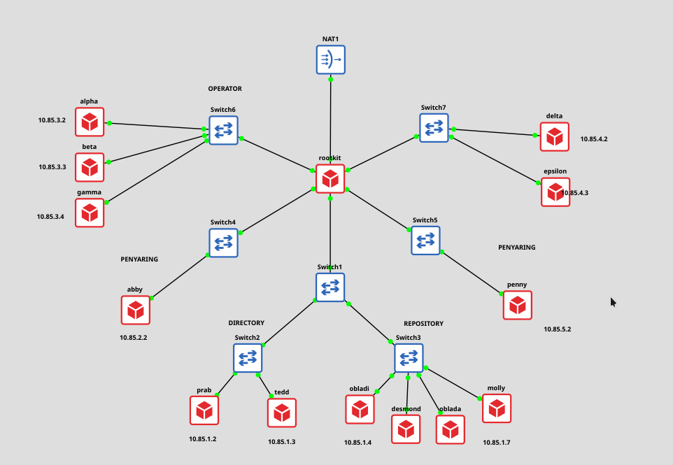

### Konfigurasi
**Node Rootkit (Router):**

```bash
auto eth0
iface eth0 inet dhcp

auto eth1
iface eth1 inet static
address 10.85.1.1
netmask 255.255.255.0

auto eth2
iface eth2 inet static
address 10.85.2.1
netmask 255.255.255.0

auto eth3
iface eth3 inet static
address 10.85.3.1
netmask 255.255.255.0

auto eth4
iface eth4 inet static
address 10.85.4.1
netmask 255.255.255.0

auto eth5
iface eth5 inet static
address 10.85.5.1
netmask 255.255.255.0
```
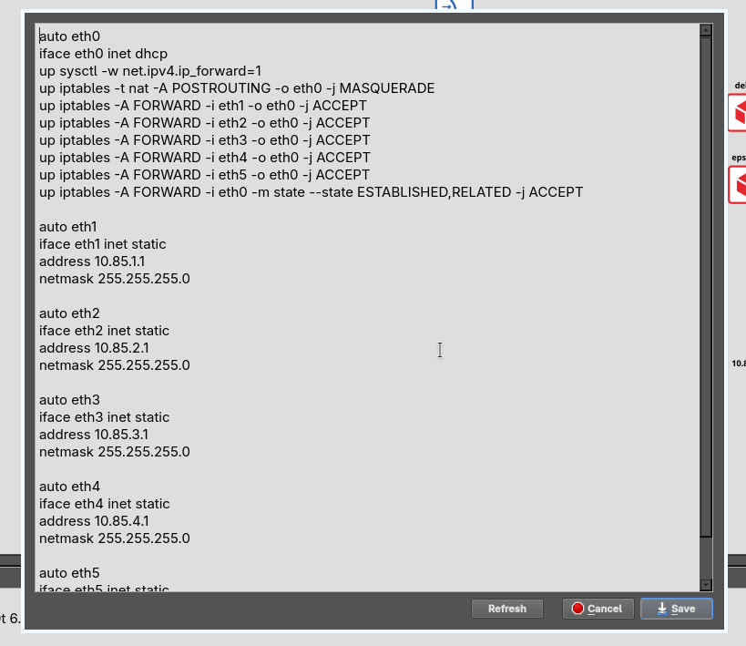


## Step 2: Konfigurasi NAT
### Soal
Buka jalur menuju NAT dengan memastikan antarmuka WAN di router rootkit aktif. Konfigurasikan NAT agar dapat meneruskan lalu lintas keluar bagi seluruh alamat internal.

### Konfigurasi (di Rootkit)
```bash
iptables -t nat -A POSTROUTING -o eth0 -j MASQUERADE
```


## Step 3: Routing Internal & Resolver Awal
### Soal
Pastikan seluruh Entitas dapat saling terhubung dan berkomunikasi lintas jalur. Tambahkan resolver 192.168.122.1 saat antarmukanya aktif agar akses internet tersedia di awal.

### Konfigurasi
Di Rootkit, aktifkan IP forwarding:
```bash
sysctl -w net.ipv4.ip_forward=1
```

Di semua node non-router, tambahkan resolver awal pada `/etc/resolv.conf`:
```bash
echo "nameserver 192.168.122.1" > /etc/resolv.conf
```
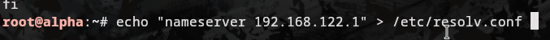


## Step 4: DNS Server (Master & Slave)
### Soal
Bangun zona `k-43.com` sebagai authoritative di node `prab` dengan SOA ke `prab.k-43.com`. Konfigurasi `tedd` sebagai slave. Atur DNS resolver berurut: prab -> tedd -> 192.168.122.1.

### Konfigurasi prab (Master)
Edit `/etc/bind/named.conf.local`:
```bash
zone "k-43.com" {
  type master;
  file "/etc/bind/jarkom/k-43.com";
  allow-transfer { 10.85.1.3; };
  notify yes;
};
```
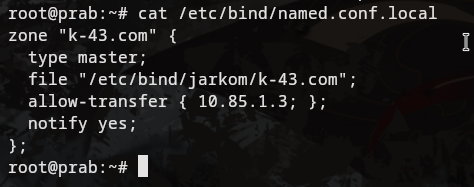
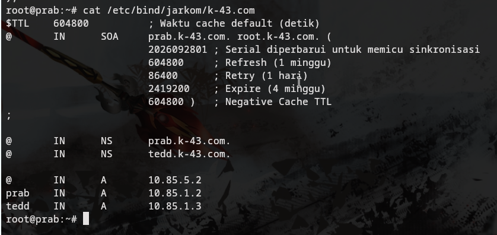

### Konfigurasi tedd (Slave)
Edit `/etc/bind/named.conf.local`:
```bash
zone "k-43.com" {
  type slave;
  file "/etc/bind/k-43.com";
  masters { 10.85.1.2; };
};
```
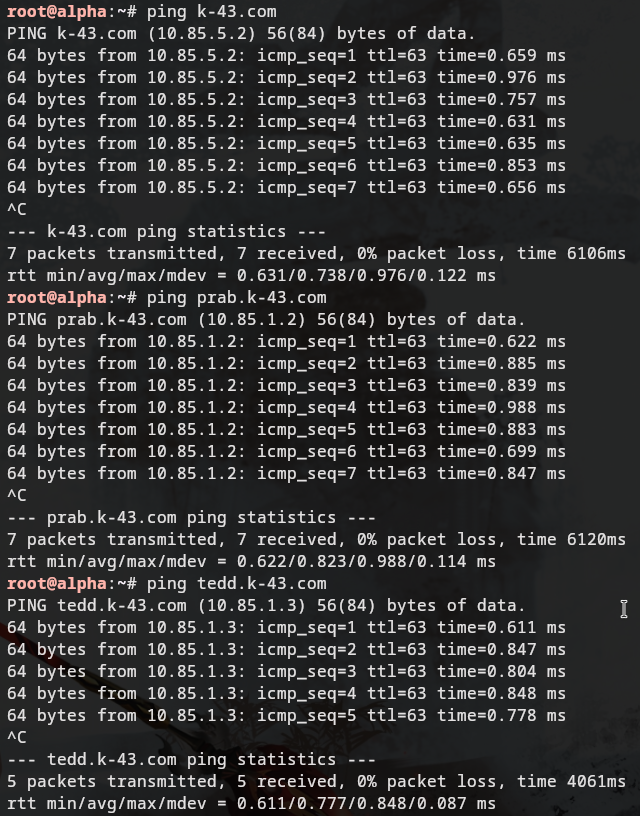


## Step 5 & 6: Hostnames & Zone Transfer
### Soal
Namai semua Entitas (hostname) sesuai glosarium. Buat setiap domain untuk masing-masing node dan assign IP. Verifikasi zone transfer agar tedd menerima salinan zona terbaru dari prab dengan nilai serial SOA yang sama.

### Konfigurasi (Prab)
Menambahkan A Record untuk semua entitas:
```bash
cat << "EOF" > /etc/bind/jarkom/k-43.com
$TTL    604800
@       IN      SOA     prab.k-43.com. root.k-43.com. (
                        2026092903 ; Serial
                        604800     ; Refresh
                        86400      ; Retry
                        2419200    ; Expire
                        604800 )   ; Negative Cache TTL
;
@       IN      NS      prab.k-43.com.
@       IN      NS      tedd.k-43.com.

prab    IN      A       10.85.1.2       
tedd    IN      A       10.85.1.3
rootkit IN      A       10.85.1.1
alpha   IN      A       10.85.3.2
beta    IN      A       10.85.3.3
gamma   IN      A       10.85.3.4
delta   IN      A       10.85.4.2
epsilon IN      A       10.85.4.3
abbey   IN      A       10.85.2.2
penny   IN      A       10.85.5.2
obladi  IN      A       10.85.1.4
desmond IN      A       10.85.1.5
oblada  IN      A       10.85.1.6
molly   IN      A       10.85.1.7
EOF
service bind9 restart
```
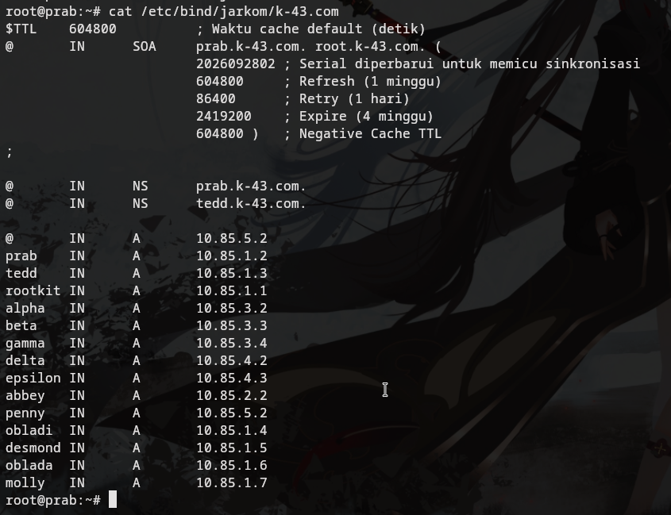
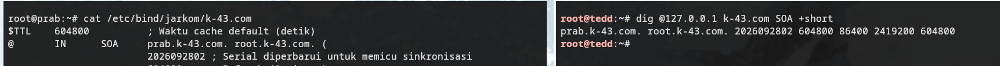


## Step 7: CNAME & Load Balancer Domains
### Soal
Tambahkan A record untuk `vault.k-43.com` dan `core.k-43.com` (Load Balancer 2 node). Tetapkan CNAME `www -> penny`, dan `static -> abbey`.

### Konfigurasi (di prab)
Tambahkan pada file zona `k-43.com`:
```bash
vault   IN      A       10.85.1.4
vault   IN      A       10.85.1.5

core    IN      A       10.85.1.6
core    IN      A       10.85.1.7

www     IN      CNAME   penny
static  IN      CNAME   abbey
```
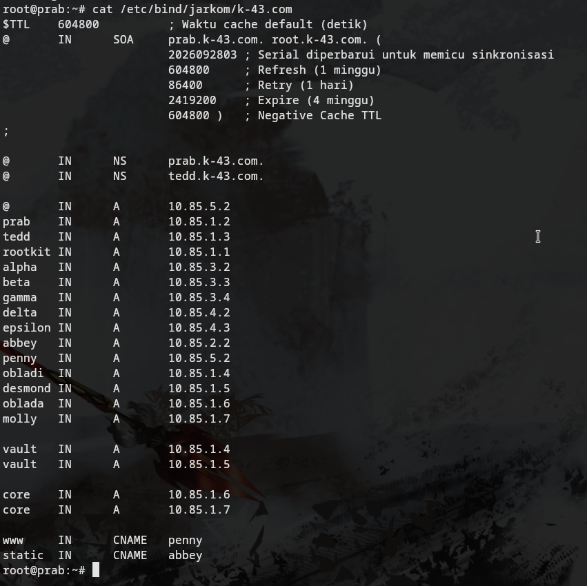
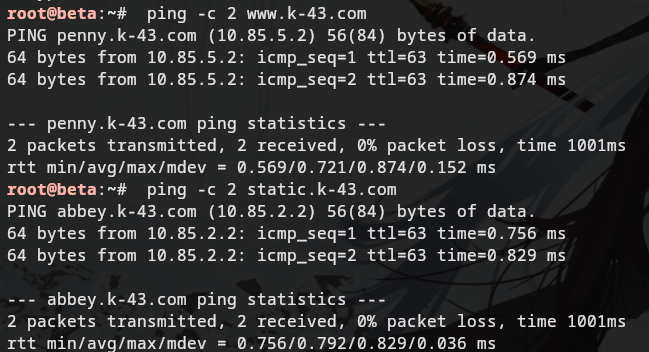
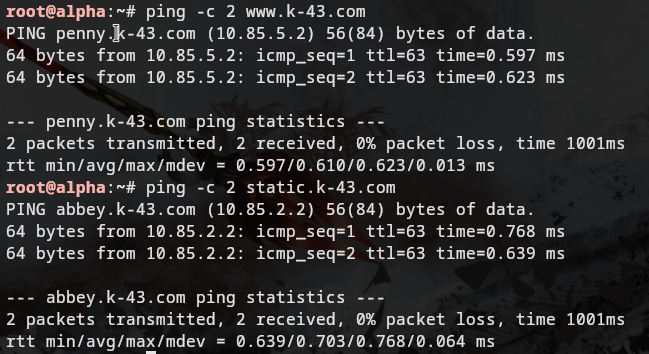


## Step 8: Reverse Zone
### Soal
Deklarasikan reverse zone untuk segmen jaringan abbey, penny, area vault, dan area core di prab. Tarik reverse zone tersebut ke tedd sebagai slave, dan tambahkan PTR record.

### Konfigurasi (Prab)
```bash
cat << "EOF" >> /etc/bind/named.conf.local
zone "1.85.10.in-addr.arpa" {
    type master;
    file "/etc/bind/jarkom/1.85.10.in-addr.arpa";
    allow-transfer { 10.85.1.3; };
};
zone "2.85.10.in-addr.arpa" {
    type master;
    file "/etc/bind/jarkom/2.85.10.in-addr.arpa";
    allow-transfer { 10.85.1.3; };
};
zone "5.85.10.in-addr.arpa" {
    type master;
    file "/etc/bind/jarkom/5.85.10.in-addr.arpa";
    allow-transfer { 10.85.1.3; };
};
EOF
```
Lalu buat PTR Record:
```bash
4 IN PTR vault.k-43.com.
5 IN PTR vault.k-43.com.
6 IN PTR core.k-43.com.
7 IN PTR core.k-43.com.
```
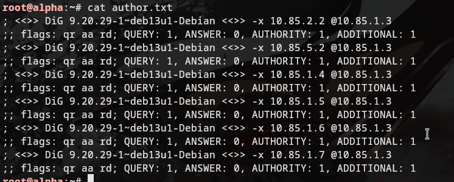
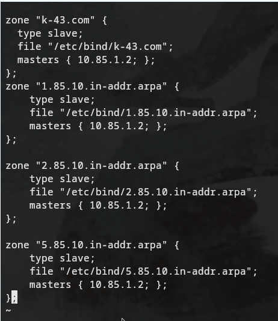
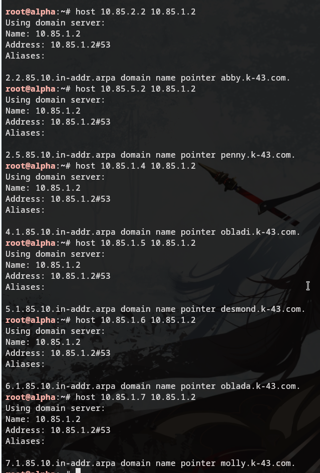


## Step 9: Web Statis (Vault: Obladi & Desmond)
### Soal
Jalankan layanan web statis pada area vault (Apache). Buka direktori `/arsip/` dan aktifkan fitur autoindex (directory listing) pada konfigurasi Apache.

### Konfigurasi Bash (Obladi & Desmond)
```bash
apt-get install apache2 -y
mkdir -p /var/www/html/arsip

cat << 'EOF' > /etc/apache2/sites-available/000-default.conf
<VirtualHost *:80>
    DocumentRoot /var/www/html
    <Directory /var/www/html/arsip>
        Options +Indexes
        AllowOverride None
        Require all granted
    </Directory>
</VirtualHost>
EOF
service apache2 restart
```
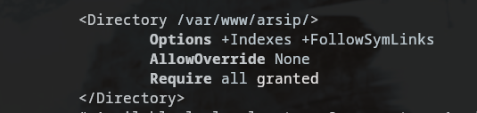
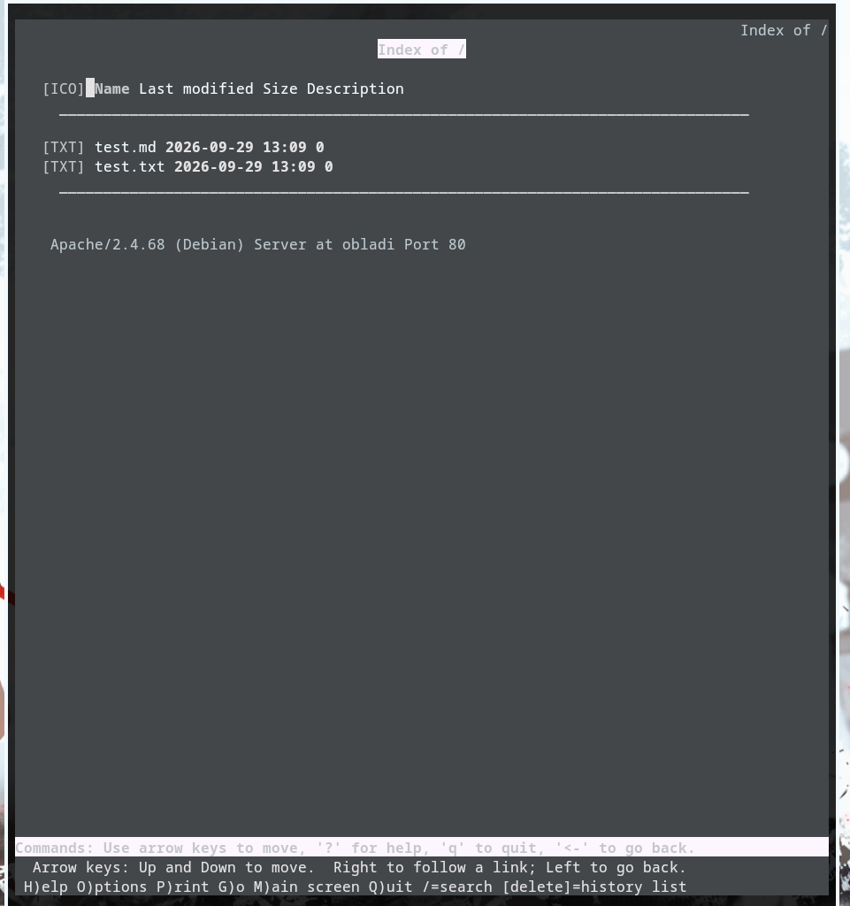


## Step 10: Web Dinamis (Core: Oblada & Molly)
### Soal
Jalankan Nginx & PHP-FPM di area core. Buat aplikasi profil dan terapkan URL rewrite ke `/profil` (tanpa .php).

### Konfigurasi (Oblada & Molly)
```bash
apt install php php-fpm nginx -y

# Konfigurasi Nginx Default
cat << "EOF" > /etc/nginx/sites-available/default 
server {
    listen 80 default_server;
    root /var/www/html;
    index index.php index.html index.htm;
    
    location / {
        try_files $uri $uri/ $uri.php?$args;
    }
    location ~ \.php$ {
        include snippets/fastcgi-php.conf;
        fastcgi_pass unix:/run/php/php8.4-fpm.sock;
    }
}
EOF

echo "<?php echo '<h1>Halaman Profil</h1><p>Ini adalah profil entitas ' . gethostname() . '</p>'; ?>" > /var/www/html/profil.php
service php8.4-fpm start
service nginx restart
```
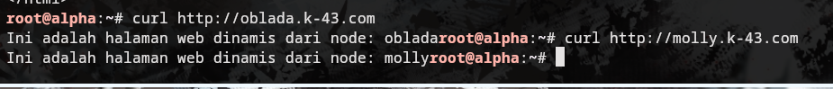
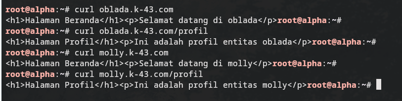


## Step 11: Reverse Proxy 
### Soal
Penny diproyeksikan sebagai proksi menuju Vault (Apache), dan Abbey menuju Core (Nginx). Konfigurasi Penny dan Abbey untuk melakukan *Load Balancing* ke backend masing-masing.

### Konfigurasi Penny (Apache Reverse Proxy)
```bash
a2enmod proxy proxy_http proxy_balancer lbmethod_byrequests headers

cat << "EOF" > /etc/apache2/sites-available/000-default.conf
<VirtualHost *:80>
    ServerName penny.k-43.com
    ProxyPreserveHost On
    RequestHeader set X-Real-IP expr=%{REMOTE_ADDR}

    <Proxy balancer://vaultcluster>
        BalancerMember http://10.85.1.4
        BalancerMember http://10.85.1.5
    </Proxy>

    ProxyPass / balancer://vaultcluster/
    ProxyPassReverse / balancer://vaultcluster/
</VirtualHost>
EOF
service apache2 restart
```
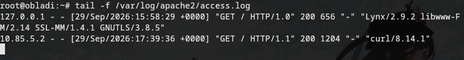


## Step 12: Basic Auth
### Soal
Terapkan Basic Auth di Penny pada direktori khusus `/admin` menggunakan otentikasi valid-user.

### Konfigurasi (Penny)
```bash
htpasswd -c /etc/apache2/.htpasswd prabs

# Konfigurasi Apache virtual host
<Location /admin>
    AuthType Basic
    AuthName "Restricted Area"
    AuthUserFile /etc/apache2/.htpasswd
    Require valid-user
</Location>
```
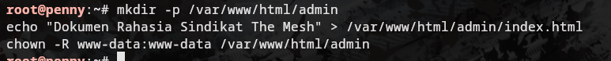
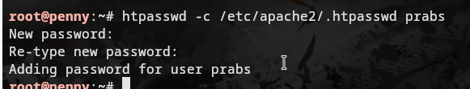
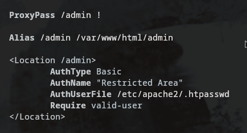
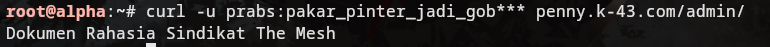


## Step 13: HTTP Redirects
### Soal
Akses ke IP/domain penny harus di-redirect permanen (301) ke `www.k-43.com`. Akses ke IP/domain abbey harus di-redirect sementara (302) ke `static.k-43.com`.

### Konfigurasi (Abbey - Nginx Redirect 302)
```nginx
server {
    listen 80;
    server_name abbey.k-43.com 10.85.2.2;
    return 302 http://static.k-43.com$request_uri;
}
```
### Konfigurasi (Penny - Apache Redirect 301)
```apache
<VirtualHost *:80>
    ServerName penny.k-43.com
    ServerAlias 10.85.5.2
    Redirect 301 / http://www.k-43.com/
</VirtualHost>
```
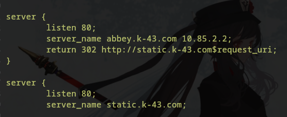
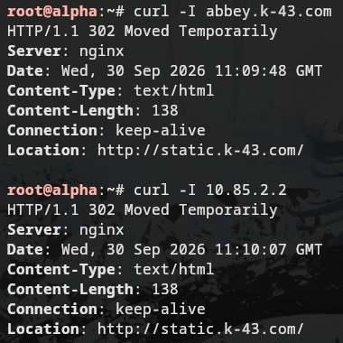
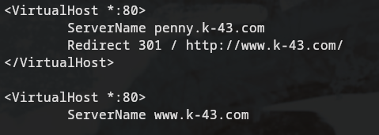
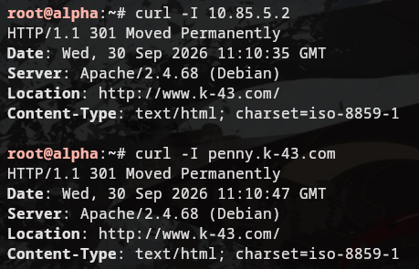


## Step 14: Forwarded IP Access Log
### Soal
Pastikan access log pada server web backend (Vault dan Core) mencatat IP asli klien, bukan IP milik Penny atau Abbey.

### Penjelasan dan Konfigurasi
Secara default, server backend hanya melihat IP dari Reverse Proxy (Penny/Abbey) yang melakukan *forwarding*. Untuk mendapatkan IP asli klien, Proxy harus mengirimkan header `X-Real-IP` (atau `X-Forwarded-For`), dan server backend harus dikonfigurasi untuk "mempercayai" proxy tersebut dan menimpa *remote address* mereka dengan isi header.

**1. Di Backend Vault (Apache pada Obladi & Desmond):**
Aktifkan modul `remoteip`, lalu tambahkan perintah ini ke dalam block `<VirtualHost>` di `/etc/apache2/sites-available/000-default.conf`:
```apache
a2enmod remoteip
# ... di dalam 000-default.conf ...
RemoteIPHeader X-Real-IP
RemoteIPInternalProxy 10.85.5.2
```
Kemudian di `/etc/apache2/apache2.conf`, ubah format log dengan mengganti `%h` menjadi `%a` agar mencatat IP klien asli:
```apache
LogFormat "%a %l %u %t \"%r\" %>s %O \"%{Referer}i\" \"%{User-Agent}i\"" combined
```

**2. Di Backend Core (Nginx pada Oblada & Molly):**
Gunakan modul `realip` bawaan Nginx dengan menambahkannya ke `/etc/nginx/sites-available/default` atau `nginx.conf`:
```nginx
set_real_ip_from 10.85.2.2;
real_ip_header X-Real-IP;
```
Dengan konfigurasi di atas, format akses log default Nginx akan otomatis menggunakan IP klien asli.
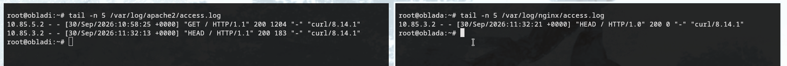
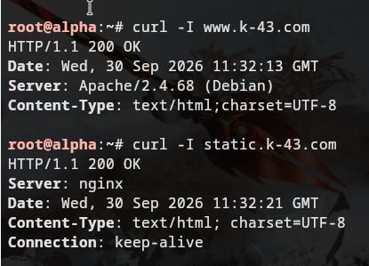


## Step 15: Special Proxies (/eternal dan /orion)
### Soal
Pada Penny, buat reverse proxy untuk path `/eternal` yang menyajikan direktori lokal (bukan ke vault). Pada Abbey, buat path `/orion` yang disajikan murni statis secara lokal.

### Penjelasan dan Konfigurasi
Untuk path ini, kita tidak ingin request-nya diteruskan (*forwarded*) ke backend Load Balancer. Alih-alih, file disajikan langsung dari penyimpanan lokal si Proxy.

**1. Konfigurasi Penny (Apache):**
Folder lokal disiapkan di `/var/www/eternal`. Di dalam `/etc/apache2/sites-available/000-default.conf`, tambahkan direktif `Alias` sebelum blok `<Proxy>`, serta buat pengecualian proxy (`ProxyPass !`) agar path `/eternal` dilayani secara lokal:
```apache
Alias /eternal /var/www/eternal
<Directory /var/www/eternal>
    Require all granted
</Directory>

# Pengecualian proxy
ProxyPass /eternal !
```

**2. Konfigurasi Abbey (Nginx):**
Folder lokal disiapkan di `/var/www/orion`. Di dalam `/etc/nginx/sites-available/default`, tambahkan blok `location /orion` yang menunjuk ke alias folder lokal tersebut:
```nginx
location /orion {
    alias /var/www/orion/;
    index index.html;
}
```
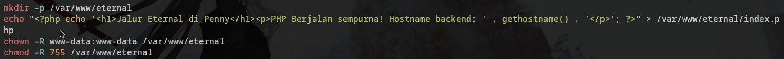
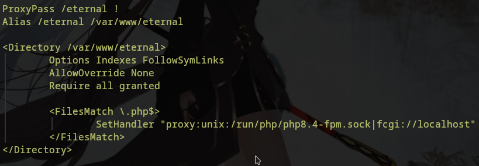


## Step 16: ApacheBench Stress Test
### Soal
Klien melakukan stress test benchmark menggunakan ApacheBench dengan total 250 request dan level konkurensi 10.

### Hasil dan Analisis (Di node Alpha)
**1. Benchmark ke Endpoint Dinamis (www.k-43.com)**
```bash
ab -n 250 -c 10 http://www.k-43.com/
```
**Hasil Utama:**
- `Complete requests: 250`
- `Failed requests: 0`
- `Requests per second: 892.25 [#/sec] (mean)`
- `Time per request: 11.208 [ms] (mean)`
Hasil ini menunjukkan bahwa Load Balancer Apache (Penny) berhasil meneruskan semua request ke backend Vault dengan lancar. Rata-rata 892 request per detik mengindikasikan throughput yang sangat baik tanpa ada satupun *drop*.

**2. Benchmark ke Endpoint Statis (static.k-43.com)**
```bash
ab -n 250 -c 10 http://static.k-43.com/
```
**Hasil Utama:**
- `Complete requests: 250`
- `Failed requests: 125 (Length: 125)`
- `Requests per second: 976.05 [#/sec] (mean)`
**Analisis *Failed Requests* (Length):**
Pada pengujian `static`, tercatat ada 125 *Failed requests*. Kegagalan ini **bukanlah sebuah error koneksi**, melainkan karena **Length Mismatch**. ApacheBench mengharapkan setiap respons memiliki ukuran byte yang identik. Namun, karena Abbey melakukan metode *Round Robin Load Balancing* ke dua backend yang berbeda (Oblada dan Molly) di mana masing-masing backend menghasilkan teks profil yang memuat hostname spesifik mereka ("Ini adalah profil entitas oblada" vs "Ini adalah profil entitas molly"), panjang karakter dari responsnya pun berbeda. ApacheBench mendeteksi perbedaan panjang ini sebagai *Failure* pada parameter Length. Secara arsitektural, sistem Load Balancing ini bekerja dengan sangat sempurna membagi beban sama rata (125 request ke masing-masing server).


## Step 17: TXT Record Klien
### Soal
Tambahkan TXT record pada Authoritative DNS (Prab) untuk mengembalikan informasi teks berisikan nama-nama klien.

### Konfigurasi (di prab)
```bash
alpha   IN      TXT     "alpha"
beta    IN      TXT     "beta"
gamma   IN      TXT     "gamma"
delta   IN      TXT     "delta"
epsilon IN      TXT     "epsilon"
```
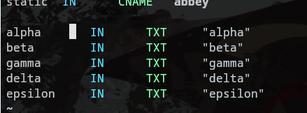
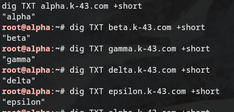


## Step 18: TTL dan DNS Cache Check
### Soal
Ubah A record milik `abbey` ke alamat IP fiktif secara acak dengan TTL sebesar 15 detik. Naikkan serial SOA. Verifikasi dari klien efek pergantian alamat IP tersebut saat cache masih berlaku dan sesudahnya.

### Konfigurasi (di prab)
```bash
abbey   15      IN      A       67.67.67.67
```
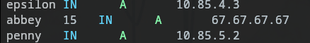

### Analisis Pengujian Cache (Mengapa Perubahan Terlihat Instan?)
Dalam praktiknya, menguji propagasi dan *cache* TTL mengharuskan *Client* memiliki **Caching Resolver** internal yang aktif (seperti `systemd-resolved` atau `dnsmasq`), atau klien menggunakan *Public Resolver* perantara yang melakukan *caching*. Pada ekosistem Node GNS3 yang menggunakan sistem minimal (Alpine/Debian ringan), resolver `dig` pada node `alpha` langsung melakukan *query* menuju server DNS Authoritative (Prab & Tedd).

Karena DNS Authoritative selalu memegang "kebenaran absolut" terkini dan tidak melakukan *caching* terhadap record-nya sendiri, setiap kali kita melakukan `dig` langsung ke Prab, server akan selalu menyajikan versi rekaman yang paling mutakhir. Oleh karena itu, setelah kita mengubah IP menjadi `67.67.67.67` di master dan me-restart layanan BIND9, perubahan tersebut langsung (*instant*) termuat saat diuji, tanpa klien tertahan oleh nilai TTL lama.


## Step 19: Outbound CNAME
### Soal
Buat CNAME record dari `outbound.k-43.com` menuju domain `http.badssl.com` untuk memfasilitasi akses keluar, dan buktikan dengan `curl`.

### Konfigurasi (di prab)
```bash
outbound IN CNAME http.badssl.com.
```
```bash
curl -I http://outbound.k-43.com
```


## Step 20: Persistence (Autostart Services)
### Soal
Seluruh pengerjaan dan konfigurasi jaringan di atas tidak boleh hilang apabila GNS3 dan setiap node-nya di-*restart*.

### Penjelasan Pendekatan Script Modular
Setiap node dalam topologi ini memiliki berkas `/root/.bashrc` yang **berbeda-beda**. Untuk menjaga lingkungan yang bersih dan modular, kami menulis *shell scripts* spesifik per peran (contoh: `11-pennyrev.sh` untuk load balancer Penny, `4-prab.sh` untuk master DNS, dsb). 

Script `.bashrc` pada setiap node hanya bertugas untuk mengecek apakah sistem baru di-boot (memeriksa file semafor `/tmp/boot_setup_done`), lalu mengeksekusi shell script instalasi/konfigurasi terkait (misal: `bash prab.sh`), dan me-*restart* *service* yang diperlukan.

```bash
# Contoh struktur dalam .bashrc sebuah node
if [ ! -f /tmp/boot_setup_done ]; then
    # Menetapkan DNS Resolver
    echo "nameserver 10.85.1.2" > /etc/resolv.conf
    echo "nameserver 8.8.8.8" >> /etc/resolv.conf

    # Melakukan pembaruan sistem dan eksekusi skrip modul
    apt update && apt upgrade -y
    bash setup_layanan_khusus_node_ini.sh
    
    # Menandai sistem telah selesai booting
    touch /tmp/boot_setup_done
fi
```
Ini memastikan saat server GNS3 mati dan dihidupkan kembali, setiap *node* dapat mengatur perannya secara independen dan mengembalikan semua *routing*, DNS, hingga pengaturan *Web Server* secara otomatis tanpa intervensi manual.